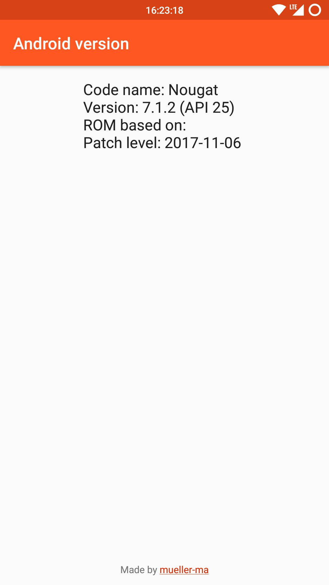

# View Android version

Simple app to view Android version information. Usually these information are visible under `Settings` => `About`, but on some ROMs, e. g. FireOS they are not visible.

# Download

Debug version of the current master available via GitLab. Main repo page => Download icon => Artifacts => Download 'build'

## License
[GNU GPL-3](https://gitlab.com/mueller-ma/View-android-version/blob/master/LICENSE)

Android is a trademark of Google LLC.
